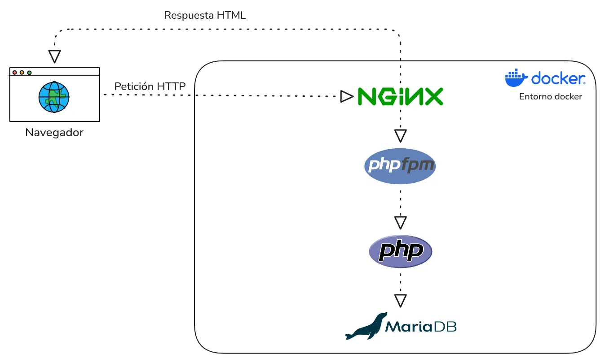
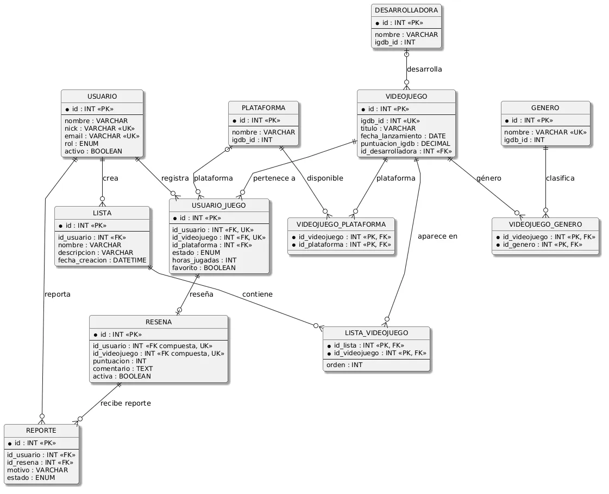

<!-- omit in toc -->
# Arquitectura

- [Visión general](#visión-general)
- [Estructura del proyecto](#estructura-del-proyecto)
- [Plantillas y rutas](#plantillas-y-rutas)
- [Base de datos](#base-de-datos)
- [Integración con IGDB](#integración-con-igdb)
- [Endpoints AJAX](#endpoints-ajax)
- [Flujos principales](#flujos-principales)
  - [Registro e inicio de sesión](#registro-e-inicio-de-sesión)
  - [Búsqueda e importación de juegos](#búsqueda-e-importación-de-juegos)
  - [Biblioteca y reseñas](#biblioteca-y-reseñas)
  - [Puntuación rápida por AJAX](#puntuación-rápida-por-ajax)
  - [Reportes](#reportes)
- [Autenticación, roles y permisos](#autenticación-roles-y-permisos)
- [Subida de ficheros](#subida-de-ficheros)
- [Panel de administración y PDF](#panel-de-administración-y-pdf)
- [Cliente y validaciones](#cliente-y-validaciones)
- [Configuración y despliegue](#configuración-y-despliegue)
- [Requisitos cubiertos](#requisitos-cubiertos)


LogNow! está planteada como una aplicación web clásica de varias páginas. PHP genera las vistas en el servidor, MariaDB guarda los datos y JavaScript se usa para validaciones, efectos visuales y acciones puntuales mediante AJAX.

La aplicación se ejecuta con Docker sobre una estructura formada por Nginx, PHP-FPM y MariaDB. Esta misma base se usa tanto en el entorno local como en el despliegue en **AWS Free Tier**.

## Visión general


El navegador envía las peticiones HTTP a Nginx. Los recursos estáticos se sirven directamente y las páginas PHP pasan a PHP-FPM, que ejecuta la aplicación. Cuando hace falta acceder a datos, PHP consulta MariaDB mediante PDO. Después, PHP genera el HTML y Nginx devuelve la respuesta al navegador.

## Estructura del proyecto

| Carpeta | Función |
|---|---|
| `includes/` | Plantillas comunes, sesión, clase `Usuario`, conexión PDO, helpers y subida de imágenes. |
| `pages/` | Vistas principales de la aplicación: catálogo, ficha, perfil, biblioteca, listas, login y registro. |
| `admin/` | Panel de administración, gestión de usuarios, reportes y exportación PDF. |
| `api/` | Comunicación con IGDB, caché local de juegos e importación inicial. |
| `ajax/` | Acciones internas que devuelven JSON para mejorar la experiencia sin recargar. |
| `assets/` | CSS, JavaScript, favicons, imágenes por defecto y recursos del frontend. |
| `uploads/` | Imágenes subidas por usuarios: avatares y encabezados. |
| `sql/` | Script de creación de la base de datos (solo como referencia). |
| `docs/` | Documentación del proyecto. |

## Plantillas y rutas

Las vistas comparten cabecera, navegación inferior móvil y pie mediante includes. Antes de cargar `includes/header.php`, cada página define variables como:

| Variable | Uso |
|---|---|
| `$titulo` | Título HTML de la página. |
| `$css` | Hojas de estilo concretas de esa vista. |
| `$pagina` | Sección activa de la navegación. |
| `$js` | Scripts necesarios en esa vista. |
| `$usarJquery` | Carga jQuery cuando una pantalla lo necesita. |
| `$cssExterno` y `$jsExterno` | Librerías externas concretas, como carruseles. |

Las rutas a recursos se escriben desde la raíz web, por ejemplo `/assets/css/main.css` o `/catalogo.php`. Esto evita problemas al incluir plantillas desde `pages/` o desde `admin/`.

## Base de datos

La base de datos es MariaDB y el esquema principal está en `sql/lognow.sql`.

| Tabla | Función |
|---|---|
| `USUARIO` | Cuentas, rol, estado activo, avatar, encabezado, biografía y fecha de registro. |
| `VIDEOJUEGO` | Juegos importados desde IGDB, portada, fondo, fecha, descripción y puntuación externa. |
| `DESARROLLADORA` | Empresa desarrolladora asociada al juego. |
| `GENERO` | Géneros de videojuegos. |
| `PLATAFORMA` | Plataformas disponibles. |
| `USUARIO_JUEGO` | Biblioteca personal: estado, plataforma, horas, fechas y favorito. |
| `RESENA` | Puntuación y comentario del usuario sobre un juego. |
| `LISTA` | Listas personales creadas por los usuarios. |
| `LISTA_VIDEOJUEGO` | Juegos incluidos en cada lista. |
| `REPORTE` | Reportes enviados sobre reseñas. |

La base de datos separa dos tipos de información:

- **Datos externos de IGDB:** título, portada, fondo, descripción, fecha, géneros, plataformas y desarrolladora.
- **Datos propios de LogNow!:** usuarios, biblioteca, estados, favoritos, puntuaciones, reseñas, listas y reportes.

La puntuación de los juegos no depende de IGDB. La valoración mostrada en la aplicación sale de las puntuaciones de los usuarios de LogNow!, excepto cuando no hay ninguna puntuación registrada en el juego; en ese caso se muestra la puntuación recogida de IGDB.

<a href="img/ER.webp" target="_blank" rel="noopener">
    
</a>

Las relaciones principales son:

| Relación | Cardinalidad | Uso |
|---|---|---|
| `USUARIO` - `USUARIO_JUEGO` | 1:N | Un usuario puede guardar muchos juegos. |
| `VIDEOJUEGO` - `USUARIO_JUEGO` | 1:N | Un juego puede estar en muchas bibliotecas. |
| `USUARIO_JUEGO` - `RESENA` | 1:1 | Un usuario puede tener una reseña por juego guardado. |
| `VIDEOJUEGO` - `GENERO` | N:M | Un juego puede tener varios géneros. |
| `VIDEOJUEGO` - `PLATAFORMA` | N:M | Un juego puede estar en varias plataformas. |
| `LISTA` - `VIDEOJUEGO` | N:M | Una lista puede contener varios juegos. |
| `RESENA` - `REPORTE` | 1:N | Una reseña puede recibir reportes. |

El esquema usa claves foráneas. Las relaciones dependientes usan `ON DELETE CASCADE` cuando no tienen sentido por separado, y algunas referencias opcionales usan `ON DELETE SET NULL`, como la plataforma concreta guardada en una entrada de biblioteca.

## Integración con IGDB

La integración con IGDB está en `api/`.

| Archivo | Papel |
|---|---|
| `api/igdb.php` | Lee credenciales, obtiene el token de Twitch y llama a IGDB. |
| `api/cache.php` | Normaliza los datos de IGDB y los guarda en MariaDB. |
| `api/importar.php` | Importa juegos populares, desde el panel admin o desde consola. |

Las credenciales `TWITCH_CLIENT_ID` y `TWITCH_CLIENT_SECRET` se leen desde `.env`, no desde el código. Para llamar a IGDB, primero se pide un token a Twitch con `client_credentials`. Ese token se guarda temporalmente en `/tmp/lognow_igdb_token.json` para no pedir uno nuevo en cada consulta.

Los endpoints externos que se usan son:

| Endpoint | Método | Uso en LogNow! |
|---|---|---|
| `https://id.twitch.tv/oauth2/token` | POST | Pedir el token de acceso con `client_credentials`. |
| `https://api.igdb.com/v4/games` | POST | Buscar juegos, importar populares y obtener el detalle de un juego concreto. |

IGDB permite pedir campos relacionados dentro de la misma consulta. Por eso LogNow! no llama a endpoints separados para géneros, plataformas, portadas o desarrolladoras. Desde `games` se solicitan los campos `cover`, `artworks`, `screenshots`, `genres`, `platforms` y `involved_companies.company`.

La aplicación consulta IGDB para búsquedas e importaciones. Cuando un juego se guarda en la base de datos, también se guardan sus géneros, plataformas y desarrolladora. Así el catálogo puede funcionar con datos locales y no depende de llamar a la API externa en cada carga.

El cacheado tiene tres ventajas:

- Reduce llamadas a IGDB.
- Permite filtrar y mostrar el catálogo desde MariaDB.
- Mantiene la ficha disponible aunque la API externa falle en un momento concreto.

## Endpoints AJAX

Los endpoints AJAX son acciones internas para que la ficha de juego sea más cómoda. Se reservan para cambios rápidos como marcar favorito, estado, puntuación rápida o reporte de reseñas.

Todos devuelven JSON, comprueban que el usuario haya iniciado sesión, exigen método `POST` y validan los datos antes de modificar la base de datos.

| Endpoint | Método | Datos principales | Respuesta | Script |
|---|---|---|---|---|
| `/ajax/puntuar-juego.php` | POST | `id_videojuego`, `puntuacion` | `ok`, puntuación visible y si se creó biblioteca | `assets/js/juego.js` |
| `/ajax/toggle-favorito.php` | POST | `id_videojuego`, `favorito` | `ok` y nuevo estado de favorito | `assets/js/juego.js` |
| `/ajax/cambiar-estado.php` | POST | `id_videojuego`, `estado` | `ok`, estado guardado y si se creó biblioteca | `assets/js/juego.js` |
| `/ajax/reportar.php` | POST | `id_resena`, `motivo` | `ok` y mensaje de confirmación | `assets/js/juego.js` |

Si cada estrella, favorito o reporte recargara toda la página, la ficha sería más lenta e incómoda.

## Flujos principales

### Registro e inicio de sesión

El registro guarda el usuario en `USUARIO` usando la clase `Usuario`. El login se hace por email y, si las credenciales son correctas, `includes/auth.php` guarda en sesión el `id`, el `nick` y el `rol`.

En cada carga se comprueba si la cuenta sigue activa. Si un administrador desactiva una cuenta, esa sesión se cierra en la siguiente petición y el usuario vuelve al login con aviso.

### Búsqueda e importación de juegos

El usuario puede buscar juegos ya guardados en la base de datos. Si no hay resultados suficientes, la aplicación puede buscar también en IGDB. Los resultados externos pasan por `api/cache.php` antes de estar disponibles como juegos de LogNow!.

El administrador también puede lanzar una importación inicial desde el panel cuando el catálogo está vacío. El mismo importador puede ejecutarse por consola.

### Biblioteca y reseñas

Cuando un usuario añade un juego a su biblioteca, se crea o actualiza un registro en `USUARIO_JUEGO`. Ahí se guarda el estado, plataforma, horas, fechas y favorito.

Las reseñas se guardan en `RESENA` y están relacionadas con el usuario y el videojuego. La puntuación se almacena de 0 a 100 y se muestra al usuario como estrellas de 0,5 a 5.

### Puntuación rápida por AJAX

Desde la ficha de juego, `assets/js/juego.js` manda la puntuación a `/ajax/puntuar-juego.php`. Si el usuario todavía no tiene ese juego en biblioteca, el endpoint puede crear una entrada básica antes de guardar la puntuación.

### Reportes

Un usuario registrado puede reportar una reseña visible que no sea suya. `/ajax/reportar.php` evita reportes duplicados y guarda el motivo en `REPORTE`. Después el administrador revisa esos reportes desde `admin/reportes.php`.

## Autenticación, roles y permisos

La sesión se gestiona en `includes/auth.php`. Hay dos roles principales:

| Rol | Permisos |
|---|---|
| `usuario` | Gestionar biblioteca, puntuar, reseñar, crear listas, editar perfil y reportar reseñas. |
| `admin` | Acceder al panel de administración, gestionar usuarios, revisar reportes e importar juegos. |

Las páginas privadas comprueban si el usuario ha iniciado sesión. El panel `admin/` usa `admin/includes/proteger.php`, que exige sesión iniciada y rol `admin`.

La validación del cliente mejora la experiencia, pero no sustituye la del servidor. Los formularios y endpoints vuelven a comprobar datos antes de guardar cambios.

## Subida de ficheros

La subida de avatar y encabezado se gestiona desde `includes/upload.php`.

Las imágenes permitidas son JPG, PNG y WEBP, con un máximo de 5 MB. El navegador valida antes de enviar, y PHP vuelve a validar tamaño, tipo MIME y carpeta de destino.

Los archivos se guardan en:

| Carpeta | Uso |
|---|---|
| `uploads/avatars/` | Avatares de usuario. |
| `uploads/covers/` | Encabezados de perfil. |

El nombre real del archivo no se conserva. Se genera un nombre propio como `user-pic_*` o `user-header_*`, y cuando el usuario reemplaza una imagen anterior, la aplicación borra el archivo antiguo.

## Panel de administración y PDF

El panel de administración vive dentro de `admin/`.

Desde el panel se pueden revisar estadísticas, usuarios, estados de cuenta y reportes de reseñas. Los usuarios se pueden activar o desactivar. Los reportes se pueden descartar o resolver eliminando el comentario reportado.

La exportación PDF está en `admin/exportar-pdf.php` y usa FPDF. Exporta el listado de usuarios respetando los filtros aplicados, por ejemplo búsqueda, rol o estado.

## Cliente y validaciones

JavaScript se reparte por pantallas. No se carga todo en todas las vistas.

| Script | Uso |
|---|---|
| `assets/js/validacion.js` | Registro, login, contraseña y edición de perfil. |
| `assets/js/biblioteca.js` | Validación de fechas y modal de quitar juego. |
| `assets/js/juego.js` | Favorito, estado, puntuación rápida y reportes por AJAX. |
| `assets/js/resena-form.js` | Formulario de reseñas y contador de caracteres. |
| `assets/js/carrusel.js` | Carruseles de la página principal. |

Se usan expresiones regulares para nick, email y contraseña. También se usa el objeto `Date` para validar fechas de biblioteca. jQuery se usa en interacciones concretas, como efectos de mostrar, ocultar, fade y slide.

## Configuración y despliegue

El archivo `.env` se usa para secretos:

- `TWITCH_CLIENT_ID`
- `TWITCH_CLIENT_SECRET`
- `MARIADB_ROOT_PASSWORD`

Tanto en local como en el servidor se usa:

```bash
docker compose up -d --build
```

Los servicios principales son:

| Servicio | Función |
|---|---|
| `web` | Nginx. |
| `php` | PHP-FPM con PDO MySQL. |
| `db` | MariaDB. |
| `phpmyadmin` | Gestión visual de la base de datos. |

Para producción se ha preparado `docker-compose-prod.yml`. Este archivo mantiene la misma base del entorno local, pero añade Caddy como punto de entrada público. En local Nginx publica directamente el puerto 80, mientras que en producción Caddy gestiona el acceso HTTPS y redirige las peticiones hacia el servicio `web`.

El despliegue final se ha realizado en AWS Free Tier, usando una instancia EC2 con Ubuntu Server y Docker. El dominio `lognow.jorgemv.es` apunta a una IP elástica asociada a esa instancia, para que la dirección pública no cambie al reiniciar el servidor. Además, en el grupo de seguridad de AWS se permitió el puerto 443 para que la web pudiera estar disponible mediante HTTPS.

Cuando un usuario entra en la web, Caddy recibe la petición segura y la pasa a Nginx dentro de la red de contenedores.

La estructura interna se mantiene igual: Nginx sirve los archivos estáticos y envía las páginas PHP a PHP-FPM, mientras que MariaDB guarda los datos de la aplicación. Así el servidor publicado se parece mucho al entorno de desarrollo, pero con una entrada pública más adecuada para producción.

## Requisitos cubiertos

| Módulo | Requisito | Dónde se cumple |
|---|---|---|
| DIW | Guía de estilo web | `docs/guia-estilos.md`. |
| DIW | HTML5 semántico | Plantillas y vistas con `header`, `main`, `section`, `nav` y `footer`. |
| DIW | Diseño responsive | CSS mobile first con media queries en vistas principales. |
| DWEC | Validación y regex | `assets/js/validacion.js`, `biblioteca.js` y `resena-form.js`. |
| DWEC | Objeto `Date` | Validación de fechas en biblioteca. |
| DWEC | jQuery y AJAX | Interacciones de ficha, biblioteca, reportes y efectos visuales. |
| DWEC | Carrusel | Carruseles de juegos y reseñas recientes en la home. |
| DWES | PDO y sesiones | `includes/db.php`, `includes/auth.php` y clase `Usuario`. |
| DWES | Roles | Usuario registrado y administrador. |
| DWES | CRUD | Usuarios, biblioteca, reseñas, listas, reportes y administración. |
| DWES | PDF con FPDF | Exportación de usuarios en `admin/exportar-pdf.php`. |
| DWES | Subida de ficheros | Avatar y encabezado en edición de perfil. |
| DAPW | Contenedores | Entorno con Nginx, PHP-FPM, MariaDB y phpMyAdmin. |
| DAPW | GitHub Pages | Documentación Jekyll en `docs/`. |
| DAPW | Despliegue | AWS Free Tier con EC2 Ubuntu Server. |
