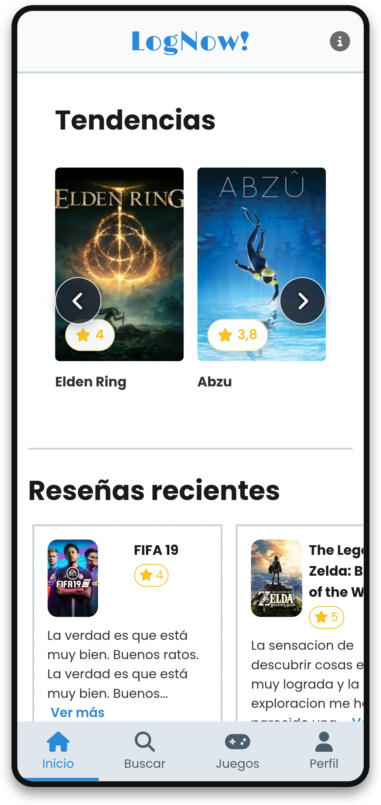
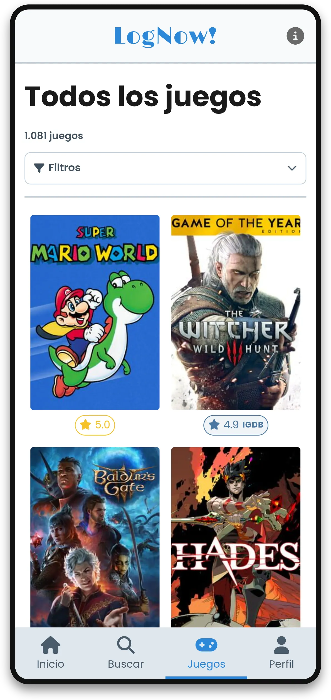
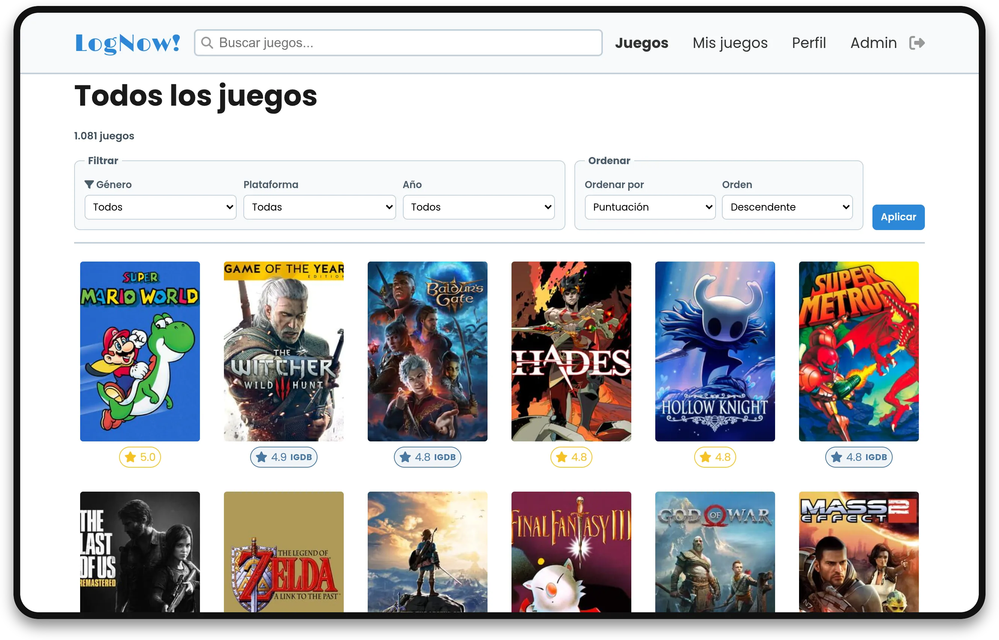
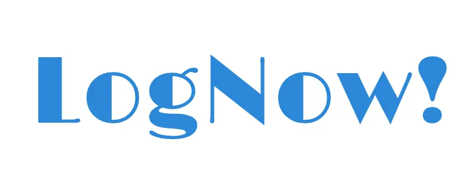

<!-- omit in toc -->
# Guía de estilos

- [Introducción](#introducción)
- [Estructura](#estructura)
- [Color](#color)
- [Tipografía](#tipografía)
- [Menús](#menús)
- [Imágenes y logotipos](#imágenes-y-logotipos)
- [Diseño responsivo y puntos de ruptura](#diseño-responsivo-y-puntos-de-ruptura)
- [Iconografía](#iconografía)
- [Accesibilidad](#accesibilidad)

## Introducción

El diseño de **LogNow!** se basa en una interfaz limpia que prioriza la facilidad de uso tanto en dispositivos móviles como en escritorio, siguiendo una metodología **_mobile-first_**.

En móvil se acercan las secciones principales a la zona inferior de la pantalla, y en escritorio se aprovecha el ancho para mostrar más contenido en columnas.

   
  Página principal en móvil.

  
  Página principal en escritorio.

 

## Estructura

La aplicación usa una estructura común en todas las páginas principales. Cada vista se apoya en una cabecera, un contenido principal, una navegación adaptada al tamaño de pantalla y un pie de página.

La maquetación usa Flexbox y CSS Grid. El catálogo se organiza como una cuadrícula de portadas, la ficha de juego combina información principal con acciones personales, y el perfil agrupa cabecera, estadísticas, favoritos, biblioteca, listas y reseñas.

   
 Catálogo en móvil.

  
  Catálogo en escritorio.

La aplicación comparte `header`, `nav` móvil y `footer` con plantillas PHP. Así se mantiene la misma navegación en todas las vistas.

La jerarquía de texto se mantiene sencilla:

| Elemento | Uso |
|---|---|
| `h1` | Título principal de cada vista. |
| `h2` | Bloques importantes, como reseñas, listas o administración. |
| Texto base | Lectura general, formularios y descripciones. |
| Etiquetas | Estados, filtros, campos y mensajes breves. |

Los textos de interfaz son directos. Se evita añadir ayuda o mensajes repetidos si el propio control ya deja clara la acción.

## Color

La paleta usa tonos neutros y un azul de acento para las acciones principales.

| Uso | Color | Aplicación |
|---|---|---|
| Principal | `#2c88d9` | Logotipo, enlaces activos, botones y elementos interactivos. |
| Puntuación | `#f7c325` | Estrellas y valoraciones. |
| Bordes | `#c3cfd9` | Separación entre bloques, tarjetas y formularios. |
| Fondos suaves | `#dfe6ed` | Navegación inferior y zonas secundarias. |
| Fondo claro | `#f7f9fa` | Cabecera y fondos de apoyo. |
| Texto principal | `#333333` | Texto general de la interfaz. |
| Títulos | `#1a1a1a` | Encabezados y textos destacados. |

El azul identifica elementos accionables: botones, enlaces activos y estados de navegación. El amarillo queda reservado para puntuaciones, de forma que las valoraciones sean reconocibles de un vistazo.

Los grises separan áreas sin competir con las portadas de los juegos. Las pantallas tienen bastante contenido visual, por eso los colores se usan con intención y no como decoración continua.

## Tipografía

La tipografía principal es **Poppins**, cargada desde Google Fonts. Se usa en textos, formularios, botones, navegación y tarjetas. Los pesos principales son 400 para texto normal, 600 para etiquetas y botones, y 700 para títulos.

La marca **LogNow!** usa **Limelight**, también desde Google Fonts. Esta es la fuente del logo textual de la aplicación. Se aplica solo al nombre de la marca mediante la clase `.marca-lognow`, para que el logotipo tenga un aspecto propio sin depender de una imagen fija.

## Menús

La navegación principal cambia según el dispositivo. En móvil se usa una barra inferior fija con accesos a Inicio, Buscar, Juegos y Perfil o Entrar. Este menú queda cerca del pulgar y permite moverse por las secciones principales sin ocupar espacio en la parte superior.

En pantallas más grandes se usa una navegación superior dentro de la cabecera. Ahí aparecen el logotipo, el buscador y los enlaces principales. La barra inferior se oculta para dejar más espacio al contenido.

Los enlaces activos se marcan con el color principal para que el usuario sepa en qué sección está. Los iconos se usan como apoyo visual, especialmente en móvil y en acciones rápidas.

## Imágenes y logotipos

Las portadas de videojuegos usan proporción vertical, parecida a una caja de juego. Se muestran con `object-fit: cover` para evitar deformaciones y con una imagen por defecto cuando IGDB no devuelve portada.

El perfil del usuario usa dos imágenes: avatar circular y encabezado horizontal. Ambas se suben desde la edición del perfil y están limitadas a 5 MB. Si el usuario no sube imágenes propias, se muestran las imágenes por defecto del proyecto.

El logotipo es el texto **LogNow!** en azul con la fuente **Limelight**. En móvil aparece centrado en la cabecera y en pantallas más grandes se alinea a la izquierda para dejar espacio al buscador y a la navegación superior.

Al ser un logotipo textual, mantiene buena nitidez en cualquier resolución y se adapta bien al diseño responsive.

## Diseño responsivo y puntos de ruptura

La navegación cambia según el ancho de pantalla:

| Ancho | Comportamiento |
|---|---|
| Menos de `768px` | Cabecera simple y barra inferior fija con Inicio, Buscar, Juegos y Perfil o Entrar. |
| Desde `768px` | Se oculta la barra inferior y aparece la navegación superior. |
| Desde `992px` | Se aprovecha más el ancho para grids, paneles laterales y tablas. |

Esta estructura facilita el uso con una mano en móvil y deja más espacio al buscador y al menú en escritorio.

## Iconografía

Los iconos se cargan desde FontAwesome 6.5.1 por CDN. Se usan como apoyo visual en navegación, búsqueda, favoritos, estados, administración y acciones rápidas.

En móvil, la barra inferior combina icono y texto para que las secciones principales sean fáciles de reconocer. En escritorio, los iconos aparecen sobre todo en acciones concretas donde ayudan a escanear más rápido la interfaz.

Las estrellas de puntuación tienen tratamiento propio con el color amarillo. Así se diferencian de la iconografía de navegación.

## Accesibilidad

La aplicación usa etiquetas semánticas de HTML5 como `header`, `nav`, `main`, `section` y `footer`. Esto mejora la organización del código y la lectura de la estructura.

Los contrastes principales están pensados para fondos claros. Los estados importantes no dependen solo del color: también se acompañan de texto, iconos, posición o cambios de forma.

En móvil se cuidan los tamaños de botones y campos para que sean cómodos al tocar. Los elementos interactivos incluyen estados visuales de `hover`, `focus` o `active` cuando corresponde.
