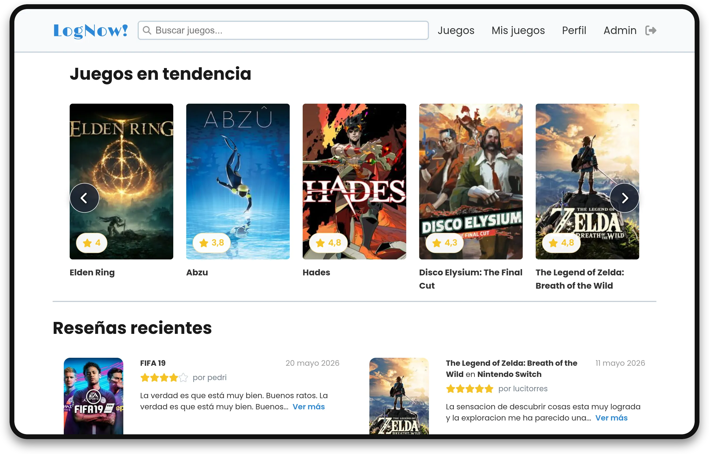

<!-- omit in toc -->
# Documentación - LogNow!

## Aplicación web de seguimiento y reseñas de videojuegos

**LogNow!** es una aplicación web para consultar videojuegos, guardar una biblioteca personal, escribir reseñas, puntuar títulos, crear listas y gestionar perfiles de usuario.

Esta documentación recoge el funcionamiento del proyecto, la arquitectura, la guía de instalación, el manual de uso y las decisiones principales tomadas durante el desarrollo.

## Índice de contenidos

1. [Introducción](introduccion.html)
2. [Instalación](instalacion.html)
3. [Uso](uso.html)
4. [Arquitectura](arquitectura.html)
5. [Guía de estilos](guia-estilos.html)
6. [Conclusiones](conclusiones.html)
7. [Referencias](referencias.html)
