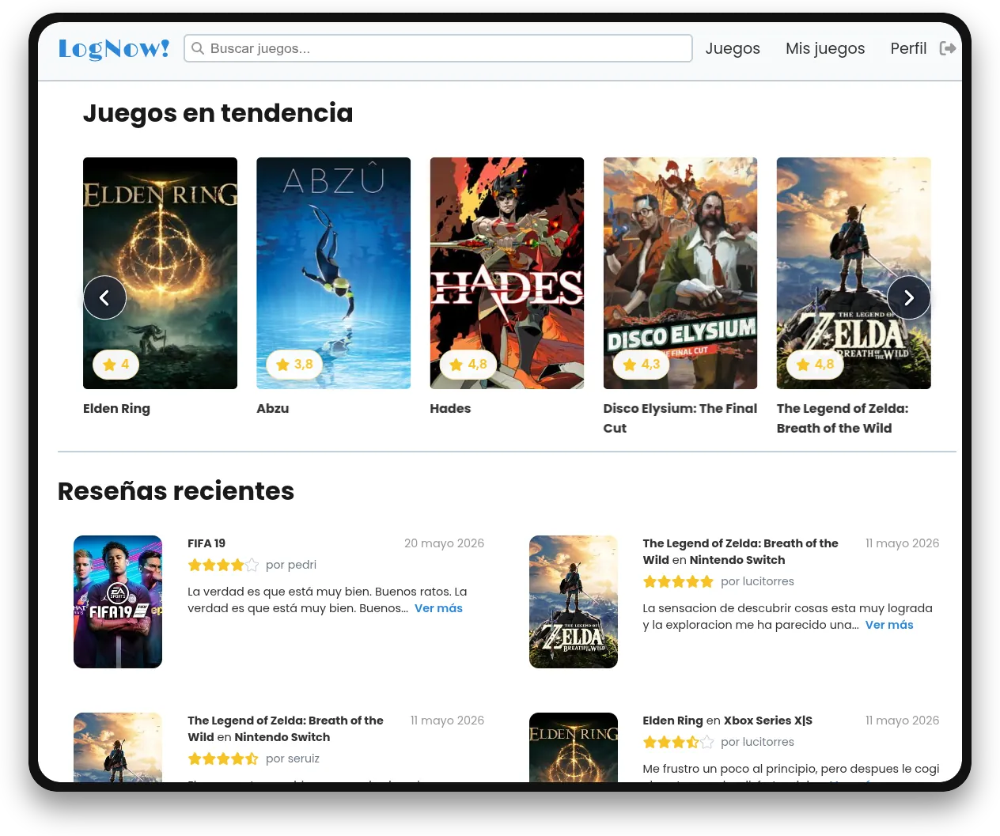
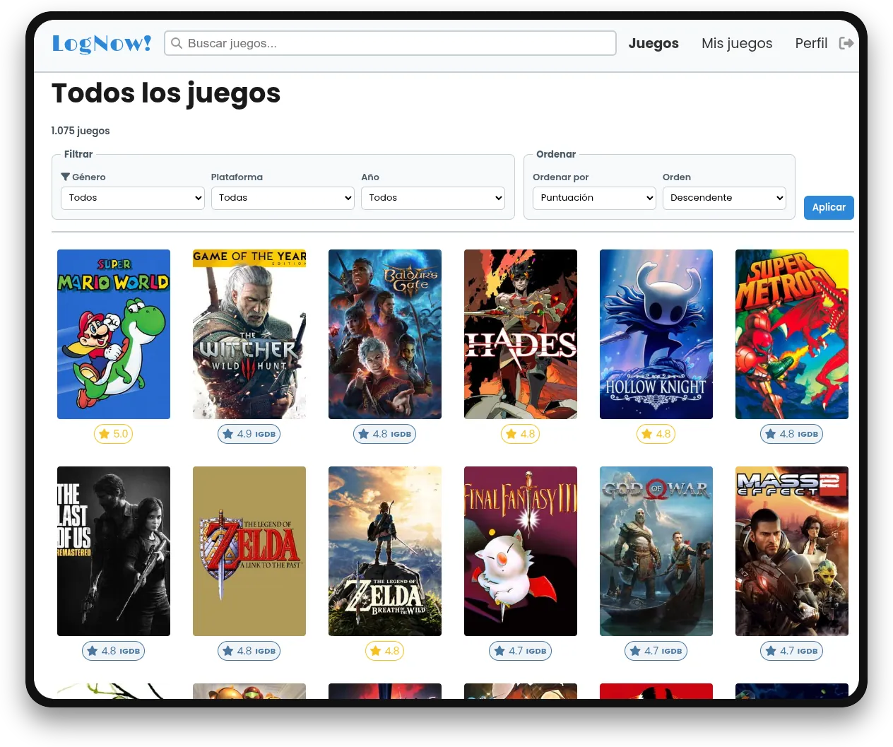
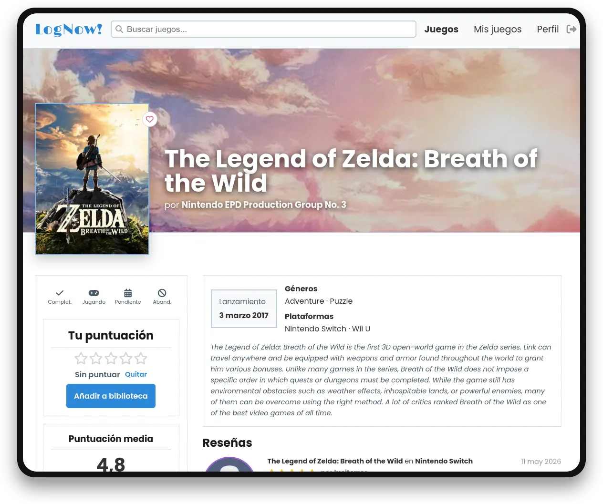
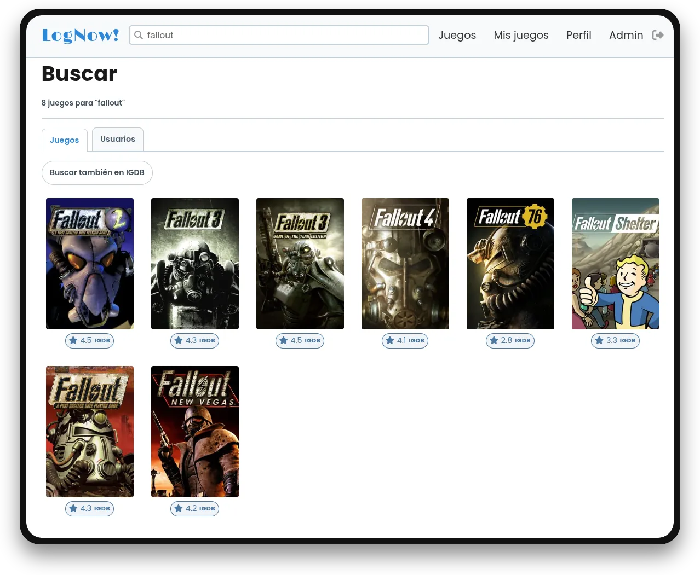
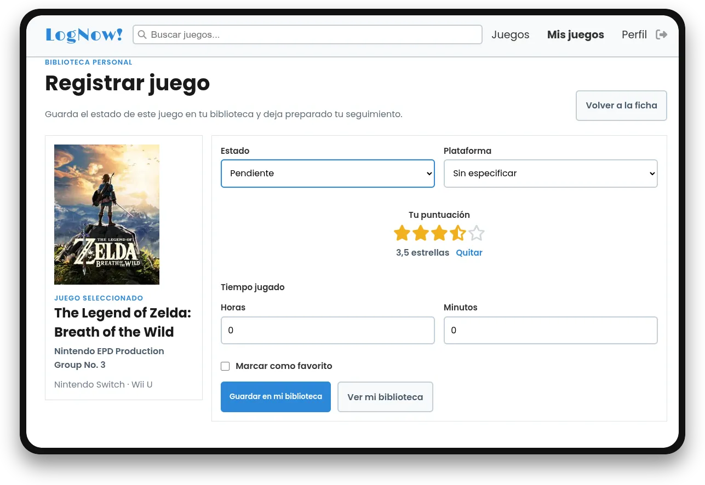
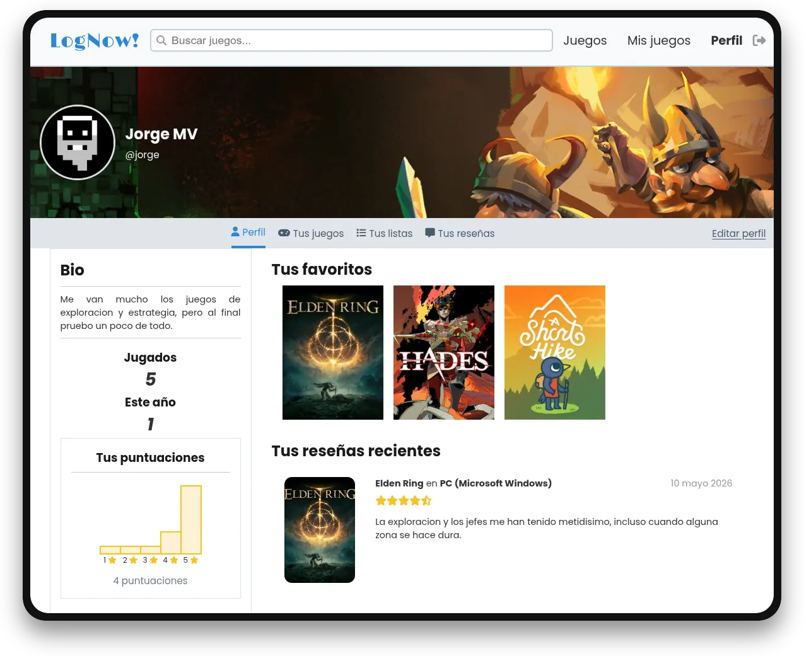
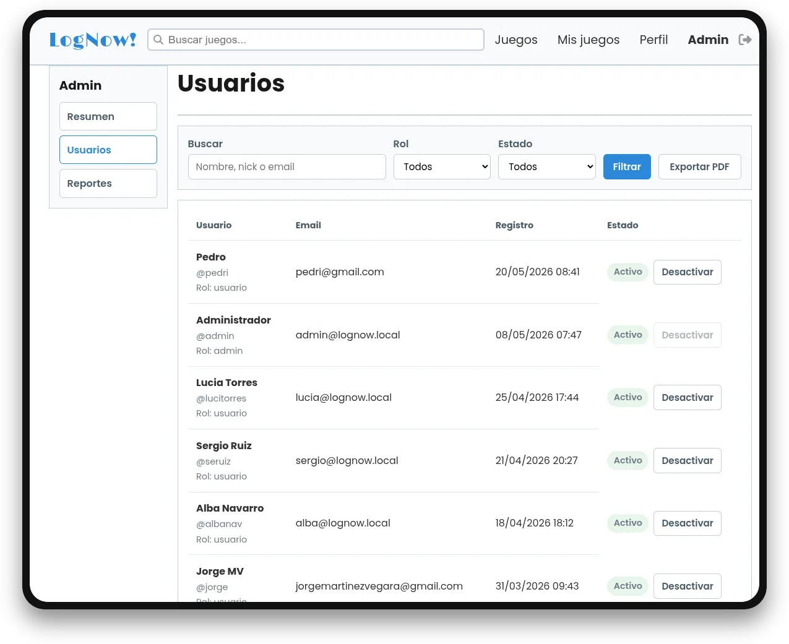

<!-- omit in toc -->
# Uso

- [Capturas](#capturas)
  - [1. Página principal](#1-página-principal)
  - [2. Catálogo](#2-catálogo)
  - [3. Ficha de videojuego](#3-ficha-de-videojuego)
  - [4. Búsqueda](#4-búsqueda)
  - [5. Registro de actividad](#5-registro-de-actividad)
  - [6. Perfil de usuario](#6-perfil-de-usuario)
  - [7. Panel de administración](#7-panel-de-administración)
- [Usuarios tipo](#usuarios-tipo)
  - [Invitado](#invitado)
  - [Usuario registrado](#usuario-registrado)
  - [Administrador](#administrador)
- [Funcionalidades principales](#funcionalidades-principales)
  - [Catálogo y ficha de juego](#catálogo-y-ficha-de-juego)
  - [Biblioteca personal](#biblioteca-personal)
  - [Puntuaciones y reseñas](#puntuaciones-y-reseñas)
  - [Listas](#listas)
  - [Perfil y cambio de contraseña](#perfil-y-cambio-de-contraseña)
  - [Panel de administración](#panel-de-administración)
  - [Reportes y exportación PDF](#reportes-y-exportación-pdf)
  - [Interacciones JavaScript](#interacciones-javascript)
- [Permisos principales](#permisos-principales)
- [Flujo básico](#flujo-básico)

## Capturas

### 1. Página principal

Punto de entrada donde se visualizan las tendencias y la actividad reciente de la comunidad.

### 2. Catálogo

Página donde se muestran los juegos y pueden filtrarse.

### 3. Ficha de videojuego

Vista de detalle con la información técnica traída de la API y el resumen de la interacción de los usuarios.

### 4. Búsqueda

Página para buscar juegos y usuarios.

### 5. Registro de actividad

Formulario donde el usuario gestiona su progreso con un juego.

### 6. Perfil de usuario

Vista del perfil de un usuario.

### 7. Panel de administración

Página donde un administrador puede gestionar reportes y usuarios.

## Usuarios tipo

### Invitado

Un visitante sin iniciar sesión puede **navegar** por la parte pública de la aplicación.

Desde la página principal puede ver juegos en tendencia y reseñas recientes de la comunidad. También puede entrar al catálogo, aplicar filtros, buscar juegos y usuarios, y abrir la ficha de cada título y perfil.

En la ficha de un juego se muestra la información principal: portada, título, desarrolladora, géneros, plataformas, fecha de lanzamiento, descripción, puntuación media y reseñas publicadas. El invitado puede consultar estos datos, pero no puede guardar juegos ni publicar contenido.

### Usuario registrado

El usuario registrado puede usar LogNow! como **biblioteca personal**.

Después de crear una cuenta e iniciar sesión, puede añadir juegos a su biblioteca, marcar estados, puntuar títulos, escribir reseñas, crear listas y editar su perfil. También puede cambiar su contraseña desde la pantalla de edición de perfil.

En la edición de perfil puede subir avatar y encabezado. Si cambia una imagen, la anterior se elimina del servidor, y también puede quitar su avatar o encabezado manualmente.

### Administrador

El administrador tiene acceso a un **panel propio** desde la navegación superior.

Desde el panel puede consultar estadísticas generales, revisar usuarios registrados, filtrar cuentas por rol o estado y activar o desactivar usuarios. También puede revisar reportes enviados por la comunidad sobre reseñas.

Cuando se desactiva una cuenta, ese usuario no puede volver a iniciar sesión. Si ya tenía la sesión abierta, se le cierra en la siguiente carga. Su perfil público muestra un aviso de perfil desactivado, pero sus reseñas ya publicadas siguen visibles en las fichas de juego.

Si el catálogo todavía está vacío, el panel muestra un botón para lanzar la importación inicial de juegos desde IGDB.

Cuando una reseña reportada no incumple nada, el administrador puede descartar el reporte. Si el comentario no debe seguir visible, puede eliminarlo; al hacerlo se eliminan también los reportes asociados a esa reseña.

El panel también permite exportar el listado de usuarios a PDF, respetando los filtros aplicados en la pantalla de usuarios.

## Funcionalidades principales

### Catálogo y ficha de juego

El catálogo permite consultar los videojuegos guardados en LogNow!, aplicar filtros por género, plataforma o año, y ordenar los resultados. La búsqueda por texto se realiza desde el buscador general de la aplicación.

Cada ficha de juego reúne la información principal del título: portada, desarrolladora, géneros, plataformas, fecha de lanzamiento, descripción, puntuación media y reseñas publicadas. Si el usuario ha iniciado sesión, desde la ficha también puede guardar el juego en su biblioteca y realizar acciones personales.

### Biblioteca personal

La biblioteca es la parte donde cada usuario organiza los juegos que le interesan. Un juego puede estar marcado como jugando, completado, por jugar o abandonado.

Además del estado, el usuario puede indicar plataforma, horas jugadas, fechas, favorito y puntuación personal. Estos datos permiten que el perfil muestre una actividad más completa que una simple lista de juegos guardados.

### Puntuaciones y reseñas

La puntuación permite valorar rápidamente un juego. Se guarda asociada al usuario y al videojuego, y se usa para calcular las medias que se muestran en la aplicación.

Cuando el usuario quiere dejar una opinión más completa, puede escribir una reseña. Las reseñas aparecen en la ficha del juego y también en el perfil del usuario, siempre que sigan visibles. En las fichas y en el tab de reseñas del perfil se muestran paginadas para evitar listas demasiado largas. Si una reseña es larga, se puede desplegar con "Leer más" en el perfil y en la ficha del juego.

Cuando una reseña ya está publicada, su puntuación no se puede quitar desde la puntuación rápida. Para cambiarla, el usuario debe editar la reseña completa o eliminarla.

### Listas

Las listas sirven para agrupar juegos con un criterio propio. Un usuario puede crear listas personales desde su perfil y añadir juegos desde la ficha de cada título.

Esta funcionalidad permite separar juegos por ideas más concretas que los estados de biblioteca, por ejemplo favoritos de un género, juegos pendientes de una saga o títulos recomendados.

Solo se pueden añadir a una lista juegos que existan en el catálogo local y que todavía no estén guardados en esa misma lista.

### Perfil y cambio de contraseña

El perfil muestra la información pública del usuario: avatar, encabezado, biografía, estadísticas, favoritos, biblioteca, listas y reseñas. Desde ahí se puede revisar la actividad propia de forma agrupada. La cifra de jugados no incluye juegos pendientes, y el contador de este año se basa en juegos iniciados durante el año actual.

En la edición de perfil se pueden cambiar los datos básicos y las imágenes personales. El avatar permite identificar al usuario en reseñas y listados, y la imagen de encabezado personaliza la parte superior del perfil. Si no se suben imágenes propias, la aplicación mantiene imágenes por defecto.

Las imágenes de perfil se guardan con nombres generados y no con el nombre original del archivo. Desde el mismo formulario también se puede eliminar el avatar o el encabezado actual.

La contraseña se cambia en un bloque separado para pedir la contraseña actual, la nueva contraseña y su repetición.

### Panel de administración

El panel de administración centraliza la gestión interna de LogNow!. Desde él se pueden ver estadísticas generales, acceder al listado de usuarios, revisar cuentas y consultar los reportes enviados por la comunidad.

Cuando el catálogo no tiene ningún juego importado, el panel muestra una acción para lanzar la importación inicial desde IGDB. Así el administrador puede preparar el catálogo sin entrar directamente al script.

### Reportes y exportación PDF

Los usuarios pueden reportar reseñas que consideren inadecuadas. El administrador revisa esos reportes y decide si los descarta o si elimina la reseña reportada.

La pantalla de usuarios del panel permite filtrar cuentas por rol o estado. Ese listado puede exportarse a PDF respetando los filtros aplicados, lo que cubre una salida documental sencilla desde la propia aplicación.

### Interacciones JavaScript

La aplicación usa JavaScript para que algunas acciones sean más cómodas. Hay validaciones en formularios, comprobación de fechas y cambios rápidos que evitan recargar la página entera.

También se usan AJAX y jQuery en acciones concretas, como actualizar favoritos, cambiar estado o puntuación, mostrar y ocultar partes de la interfaz y abrir el modal de reportes. Estos endpoints se usan para acciones pequeñas de la ficha del juego, porque sería incómodo recargar toda la página cada vez que el usuario pulsa un favorito o cambia una puntuación.

La edición de perfil valida las imágenes antes de enviarlas. Si el avatar o el encabezado supera los 5 MB, la interfaz muestra el aviso directamente y evita que el servidor responda con un error poco claro.

En la página principal, los carruseles ayudan a navegar por juegos y reseñas recientes.

Las acciones delicadas, como eliminar una reseña o resolver un reporte desde administración, piden confirmación antes de enviar el formulario.

## Permisos principales

| Funcionalidad | Invitado | Usuario registrado | Administrador |
|---|:---:|:---:|:---:|
| Consultar catálogo | Sí | Sí | Sí |
| Buscar juegos | Sí | Sí | Sí |
| Ver fichas y reseñas | Sí | Sí | Sí |
| Ver perfiles | Sí | Sí | Sí |
| Gestionar biblioteca | No | Sí | Sí |
| Puntuar juegos | No | Sí | Sí |
| Escribir reseñas | No | Sí | Sí |
| Crear listas personales | No | Sí | Sí |
| Editar perfil | No | Sí | Sí |
| Cambiar contraseña | No | Sí | Sí |
| Acceder al panel admin | No | No | Sí |
| Gestionar usuarios | No | No | Sí |
| Revisar reportes | No | No | Sí |
| Exportar usuarios a PDF | No | No | Sí |

## Flujo básico

Un uso normal de la aplicación sería:

1. Buscar un juego desde el catálogo o el buscador.
2. Entrar en su ficha.
3. Añadirlo a la biblioteca personal.
4. Marcar su estado y plataforma.
5. Puntuarlo o escribir una reseña.
6. Revisar después ese seguimiento desde el perfil o desde la sección de juegos guardados.

Este flujo cubre la parte principal de LogNow!: consultar información externa, guardarla en una biblioteca propia y añadir una valoración personal.
